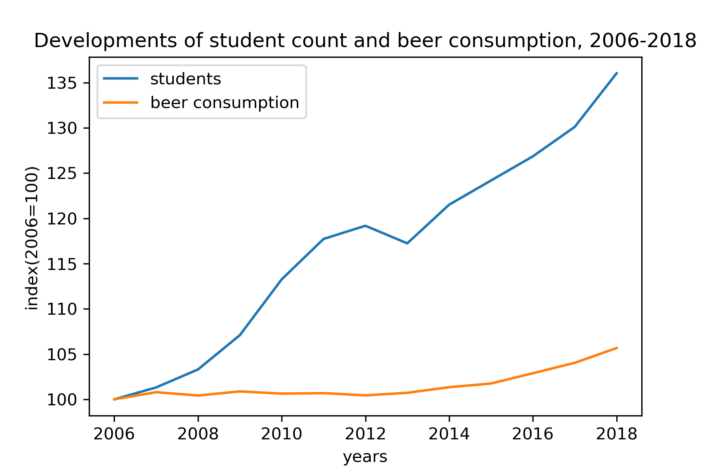

Joos Akkerman (11304723)

Titles of papers:

1. Fantastic yeasts and where to find them: the hidden diversity of dimorphic fungal pathogens
2. An analysis of the forces required to drag sheep over various surfaces
3. The neurocognitive effects of alcohol on adolescents and college students

This graph shows that students are extremely responsible and should be allowed the consumptions of greater quantities of beer.
